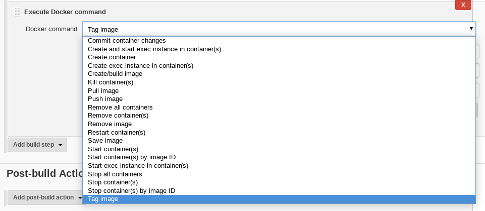
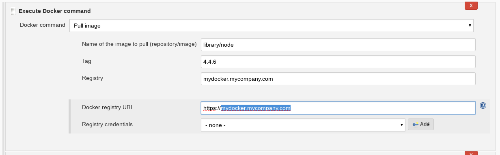
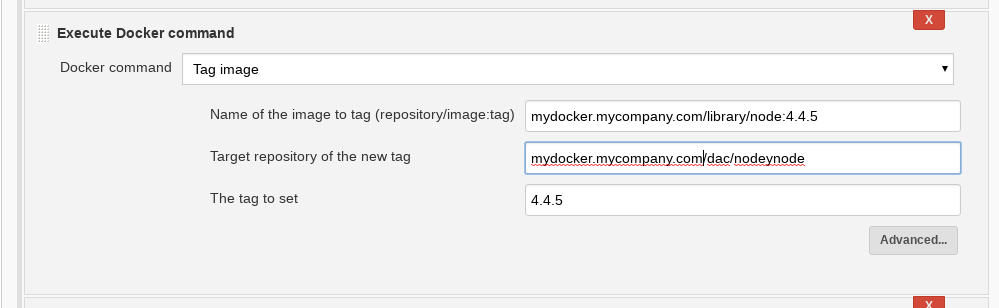
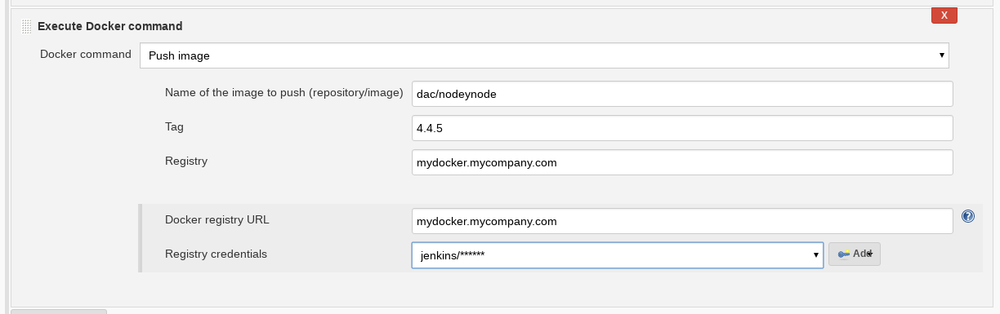

# Docker Build Step Plugin

This plugin allows adding various Docker commands into your Jenkins Freestyle job as a build step.

# Plugin Information

If you would like to use Docker for dynamic node provisioning, you should check the [Docker plugin](https://wiki.jenkins-ci.org/display/JENKINS/Docker+Plugin).

## Commands

Plugin currently support following commands:

- commit changes in specified container
- create new container from image
- create image from Dockerfile
- create exec command
- kill container(s)
- pull image from a repository
- push image to a repository
- remove container(s)
- remove all containers
- restart container(s)
- start container(s)
- stop container(s)
- stop all containers
- start/stop all containers created from specified image
- start exec command

## Build Variables

Some commands also export build variables, so that you can easily use them in subsequent build steps.

Variables exported by create and start commands:

`DOCKER_CONTAINER_IDS` - IDs of created/started containers

`DOCKER_IP_$HOSTNAME` - IP of running container with hostname `$HOSTNAME`

When port binding is set up (in start command), the following environment variables are exported:

`DOCKER_HOST_BIND_PORTS` - contains comma separated list of ports to which are bound docker container ports

`DOCKER_HOST_PORT_$SCHEMA_$PORT` - which docker container port is bound to this port (e.g. DOCKER_HOST_PORT_TCP_80 would contain value 8080 in case that container port 8080 is bound to port 80 on host)

`DOCKER_HOST_SOCKET_$SCHEMA_$PORT` - host IP:PORT to which conatiner $PORT using $SCHEMA is bound. E.g. with following port binding 127.0.0.1:80:8080, container TCP port is 8080 is bound to host port 80 on loopback and DOCKER_HOST_SOCKET_TCP_8080 will contain 127.0.0.1:80.

## Known limitations

Commands run without any issue only on master, on remote slaves some commands may fail execution. See [JENKINS-24071](https://issues.jenkins-ci.org/browse/JENKINS-24071) for details.

# Setup

## Build Nodes

The Docker service must be installed and running on nodes where you run the build.

## Set Docker URL

In Jenkins global configuration, you need to specify Docker REST API URL.

Jenkins -> Manage Jenkins -> Configure System -> Docker Builder

* Configure Docker server REST API URL
  * For Linux nodes, set the local socket `unix:///var/run/docker.sock`
  * For other nodes, you may need to set something like `tcp://127.0.0.1:2375`
* Test the connection.

# Usage

## Commands

In the build area of ​​Jenkins Job, add the build step

    Execute Docker command

There is a range of Docker Command options, roughly correlating with the Docker CLI commands.

## Docker Pull

### Fields

| Field | Description |
| ----- | ----- |
| Name of the image to pull (repository/image:tag) |  base name of the image |
| Tag | Actual tag, e.g. `3.4.5` or `latest` |
| Registry | hostname of registry used to store images e.g. `mydocker.mycompany.com` |
| Docker registry URL | registry URL to use for pull authentication, e.g. `https://mydocker.mycompany.com` |
| Registry Credentials | ...Choose correct credential here from the list... |

## Docker Tag

### Fields

| Field | Description |
| ----- | ----- |
| Name of the image to tag (repository /image:tag) |  base name of the image |
| Target repository of the new tag | destination repository/image name e.g. `dac/nodeynode` |
| The tag to set | Actual destination tag, e.g. `3.4.5` or `latest` |

### Scenario 1: Tag a Dockerhub image with a local tag

#### Effective Docker command line

    docker tag library/node:8.9.4 dac/nodeynode:8.9.4

#### Settings

| Field | Value |
| ----- | ----- |
| Name of the image to tag (repository /image:tag) | library/node:8.9.4 |
| Target repository of the new tag | dac/nodeynode |
| The tag to set | 8.9.4 |

#### Result

    [Docker] INFO: Done
    [Docker] INFO: start tagging image library/node:8.9.4 in dac/nodeynode as 8.9.4
    [Docker] INFO: Tagged image library/node:8.9.4 in dac/nodeynode as 8.9.4

### Scenario 2: Tag a private repo image with a local tag

#### Effective Docker command line

    docker tag mydocker.mycompany.com/library/node:4.4.6 dac/nodeynode:4.4.6

#### Settings

| Field | Value |
| ----- | ----- |
| Name of the image to tag (repository/image:tag) | mydocker.mycompany.com/library/node:4.4.6 |
| Target repository of the new tag | dac/nodeynode |
| The tag to set | 4.4.6 |

#### Result

    [Docker] INFO: Done
    [Docker] INFO: start tagging image mydocker.mycompany.com/library/node:4.4.6 in dac/nodeynode as 4.4.6
    [Docker] INFO: Tagged image mydocker.mycompany.com/library/node:4.4.6 in dac/nodeynode as 4.4.6

## Docker Push

### Fields

| Field | Description |
| ----- | ----- |
| Name of the image to push (repository /image) | base name of the image |
| Tag | Actual tag, e.g. `3.4.5` or `latest` |
| Registry | hostname of registry used to store images e.g. `mydocker.mycompany.com` |
| Docker registry | registry hostname to use for authentication, e.g. `mydocker.mycompany.com` |
| Registry Credentials | ...Choose correct credential here from the list... |

### Scenario 1: Push a local image to a private repo

#### Effective Docker command line

    docker login ...
    docker push mydocker.mycompany.com/dac/nodeynode:4.4.6  

#### Settings

| Field | Value |
| ----- | ----- |
| Name of the image to push (repository /image) | dac/nodeynode |
| Tag| 4.4.6 |
| Registry | mydocker.mycompany.com |
| Docker registry | mydocker.mycompany.com |
| Registry Credentials | ...Choose correct credential here from the list... |

#### Result

    [Docker] INFO: Pushing image mydocker.mycompany.com/dac/nodeynode:4.4.6
    [Docker] INFO: PushResponseItem[stream=<null>,status=The push refers to repository [mydocker.mycompany.com/dac/nodeynode],progressDetail=<null>,progress=<null>,id=<null>,from=<null>,time=<null>,errorDetail=<null>,error=<null>,aux=<null>]
    [Docker] INFO: PushResponseItem[stream=<null>,status=Preparing,progressDetail=ResponseItem.ProgressDetail[current=<null>,total=<null>,start=<null>],progress=<null>,id=c747e356ef2e,from=<null>,time=<null>,errorDetail=<null>,error=<null>,aux=<null>]
    …
    [==================================================>]  326.3MB,id=ec0200a19d76,from=<null>,time=<null>,errorDetail=<null>,error=<null>,aux=<null>]
    [Docker] INFO: PushResponseItem[stream=<null>,status=Pushing,progressDetail=ResponseItem.ProgressDetail[current=326362624,total=318467546,start=<null>],progress=[==================================================>]  326.4MB,id=ec0200a19d76,from=<null>,time=<null>,errorDetail=<null>,error=<null>,aux=<null>]
    [Docker] INFO: PushResponseItem[stream=<null>,status=Pushed,progressDetail=ResponseItem.ProgressDetail[current=<null>,total=<null>,start=<null>],progress=<null>,id=ec0200a19d76,from=<null>,time=<null>,errorDetail=<null>,error=<null>,aux=<null>]
    [Docker] INFO: PushResponseItem[stream=<null>,status=4.4.6: digest: sha256:bbdd44f8824f93e3da152db5b425fd28bcab03f6746efa7ef1e20555ff21e8bd size: 1587,progressDetail=<null>,progress=<null>,id=<null>,from=<null>,time=<null>,errorDetail=<null>,error=<null>,aux=<null>]
    [Docker] INFO: PushResponseItem[stream=<null>,status=<null>,progressDetail=ResponseItem.ProgressDetail[current=<null>,total=<null>,start=<null>],progress=<null>,id=<null>,from=<null>,time=<null>,errorDetail=<null>,error=<null>,aux=ResponseItem.AuxDetail[size=1587,tag=4.4.6,digest=sha256:bbdd44f8824f93e3da152db5b425fd28bcab03f6746efa7ef1e20555ff21e8bd]]
    [Docker] INFO: Done pushing image mydocker.mycompany.com/dac/nodeynode:4.4.6

<!-- ## Docker Build and Publish -->

# Reference

* Jenkins Plugin ID: `docker-build-step`
* [`docker-build-step` in Jenkins Plugins](https://plugins.jenkins.io/docker-build-step)
* [`Docker build step plugin` in Jenkins Plugin Wiki](https://wiki.jenkins.io/display/JENKINS/Docker+build+step+plugin)
* [`docker-build-step-plugin` GitHub project](https://github.com/jenkinsci/docker-build-step-plugin)
* [Docker website](https://www.docker.com/)

# Credits

Uses components from [Docker Commons Plugin](https://wiki.jenkins.io/display/JENKINS/Docker+Commons+Plugin) which provides APIs for other Docker-related plugins

# License

See [License](./LICENSE)
